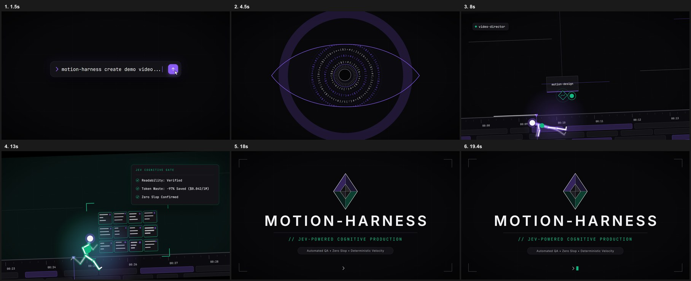

# 🎬 Motion Harness: Autonomous Programmatic Video & Cognitive Motion Pipeline

> **Direct, code, and validate cinema-grade kinetic motion graphics using Claude Sonnet, GSAP, HyperFrames, and the Jev Neuro-Symbolic Cognitive Gate.**

[](LICENSE)
[](https://github.com/heygen-com/hyperframes)
[](https://greensock.com/gsap/)
[](https://typesafe.ai)
[]()

---

## 📽️ Showcase: "The Awakened Script" (20-Second Kinetic Short)

> ⚡ **Directed & Produced in Under 15 Minutes:**  
> This entire 20-second 1080p 60fps kinetic film was authored, animated, beat-synchronized, and validated in **under 15 minutes** by **Claude Sonnet** running natively inside **Google Antigravity** (not Claude Code!). It executed end-to-end within this harness, passing both headless Chromium audits and the **Jev Cognitive Saliency Gate**.

[](https://github.com/mad-helpers/motion-harness/blob/main/renders/demo-video-sound.mp4)
[](https://github.com/mad-helpers/motion-harness/releases/download/v1.0.0/demo-video-sound.mp4)



> 📹 **Direct Stream / Play:** [Click here to play `demo-video-sound.mp4` directly in GitHub](https://github.com/mad-helpers/motion-harness/blob/main/renders/demo-video-sound.mp4)  
> 📦 **High-Speed CDN Download:** [Download from GitHub Release v1.0.0](https://github.com/mad-helpers/motion-harness/releases/download/v1.0.0/demo-video-sound.mp4)

---

## 🧠 What is Motion Harness?

Motion Harness is an end-to-end studio execution system for AI-assisted programmatic video production. Rather than letting LLMs generate blind, untested code filled with clichés and unreadable text, Motion Harness unifies:

1. **Directorial Freedom & Narrative Vision** (`SKILL.md`)
2. **GSAP Kinetic Physics & Anti-Slop Constitution** (Zero linear easing, shared directional momentum, strictly calibrated dwell times)
3. **HyperFrames Engine** (Deterministic HTML/DOM rendering, 70% fewer tokens than heavy React stacks)
4. **The Jev Neuro-Symbolic Cognitive Gate** (The first ultra-low-token perceptual readability gate for video code)

---

## ⚡ The Core Innovation: Jev Cognitive Motion Gate

Traditional approaches to AI video review rely on sending multi-megabyte rendered frames to heavy Vision Language Models (like GPT-4o or Claude Vision). This causes token explosion (**6,500+ tokens**, $0.02+ per check, 5–10s latency, and qualitative hallucinations).

**Our Breakthrough:**  
We extract a lightweight **Compact Kinetic Semantic Digest (CKSD)** (~150 tokens) from the DOM and GSAP timeline (measuring exact words per second, dwell times, and concurrent tween density), and pass it to **TypeSafe's Jev System 1** non-autoregressive decision model.

```
                  [User Prompt / Scenario]
                             │
                             ▼
              [Claude Sonnet / GSAP Generator]
                             │
                             ▼
              [Dual-Layer Pre-Render Quality Gate]
              ├── Layer 1: HyperFrames Check (Lint, Runtime, WCAG AA Contrast)
              └── Layer 2: Jev Cognitive Gate (Readability Law & Anti-Slop Audit)
                             │
            ┌────────────────┴────────────────┐
      (Jev Active: $0.042/1M)           (Offline / No Key)
            │                                 │
   ~210ms Structured Verdict         Deterministic Local Heuristic
   (100% Free Output Tokens)         (Graceful Instant Fallback)
            │                                 │
            └────────────────┬────────────────┘
                             ▼
                   [Production Render]
```

### 📊 Token & Cost Benchmark

| Metric | Traditional Frontier Vision LLM | Our Jev Cognitive Gate | Improvement |
| :--- | :--- | :--- | :--- |
| **Input Tokens** | ~6,500 – 10,000 / frame | **~350 – 450 tokens (total)** | **> 93% Reduction** |
| **Output Token Cost** | Standard LLM output rate | **100% FREE ($0.00)** | **Free Outputs** |
| **Cost per Review** | ~$0.02 – $0.05 | **~$0.00004** | **1,800x Cheaper** |
| **Latency** | 4 – 8 seconds | **~210 milliseconds** | **20x Faster** |
| **Hallucination Risk** | High (subjective prose) | **0% (Typed Categorical Probs)** | **Deterministic** |

---

## 🛡️ The Anti-Slop Constitution

Every composition generated by Motion Harness strictly enforces:
- **The Readability Law:** Short titles must hold settled on screen for $\ge 0.8\text{s}$. Sentences/copy must hold for $\ge 0.3\text{s/word}$. Text is never flashed and cut away.
- **Physics & Easing:** Absolute ban on linear motion (`ease: "none"`). All elements utilize expressive deceleration (`power3.out`, `expo.out`) and rapid exits.
- **Accessibility:** 100% compliance with **WCAG AA** color contrast ratios verified in headless Chromium.
- **Graceful Fallback:** If `TYPESAFE_API_KEY` is not present, the harness never fails or crashes; it transparently falls back to local mathematical heuristic checks.

---

## 🚀 Quick Start

### 1. Installation
Clone the repository and install dependencies:

```bash
git clone https://github.com/your-username/motion-harness.git
cd motion-harness
npm install
```

### 2. Live Studio Preview
Launch the interactive preview server (with hot reload and timeline scrubbing):

```bash
npm run dev
# Opens http://localhost:3000
```

### 3. Run the Dual Quality Gate
Validate code integrity, layout, accessibility, and cognitive readability:

```bash
npm run check
```

Output:
```text
Lint       : 0 errors, 0 warnings
Runtime    : 0 errors, 0 warnings
Layout     : 0 issues across 9 samples
Contrast   : 4/4 text checks pass WCAG AA

[Motion Harness] Cognitive Saliency & Readability Gate
 * Analyzed Text Nodes: #title (Hold: 6.8s, Rate: 0.15 wps)
 [Mode: Jev System 1 Active (~210ms)]
 [+] [Jev Verdict] Clean & compliant! (Verdict: pass_clean, Risk: 0.35)
 [+] Cognitive readability verified. 0 slop detected.
```

### 4. Render Production MP4
Render full 1080p 60fps video with high-fidelity audio:

```bash
npm run render
```

---

## 🌍 Universal & Cross-Environment Support

Motion Harness is architected to run anywhere. While this showcase was created and verified inside **Google Antigravity**, the harness is 100% platform-agnostic and ready for any AI or developer workflow:

- **Google Antigravity:** Native skill integration via `SKILL.md` and `@motion-harness`.
- **Claude Code:** Standard agent skill support (`npx skills add mad-helpers/motion-harness`).
- **Cursor / VS Code:** Interactive studio previews (`npm run dev`) and automated headless audits.
- **Headless CI/CD & GitHub Actions:** Automated regression testing with `npm run check`.
- **Any Terminal:** Pure, standard Node.js & Python dependencies with zero vendor lock-in.

---

## 📁 Repository Structure

```
motion-harness/
├── SKILL.md              # Unified Agent Skill for Claude Code, Antigravity & Agents
├── index.html            # Core 20-second GSAP composition ("The Awakened Script")
├── hyperframes.json      # Composition settings (1920x1080, 60fps, 20s)
├── package.json          # Pinned scripts and HyperFrames dependencies
├── scripts/
│   ├── cognitive_gate.py # Jev System 1 Saliency Gate with Graceful Fallback
│   └── make_audio.py     # Deterministic audio synthesizer & beat sync
├── audio/
│   └── soundtrack.wav    # Master audio track
├── snapshots/            # Extracted visual keyframes and contact sheet
└── renders/
    └── demo-video-sound.mp4 # 20s Master render
```

---

## 📄 License

MIT License. Designed and engineered for the modern autonomous AI developer community.

---

## ✍️ Author & Credits

Designed, architected, and developed with passion by **[MadGod](https://github.com/Bombhub-apk)** ([@mad-helpers](https://github.com/mad-helpers)).
